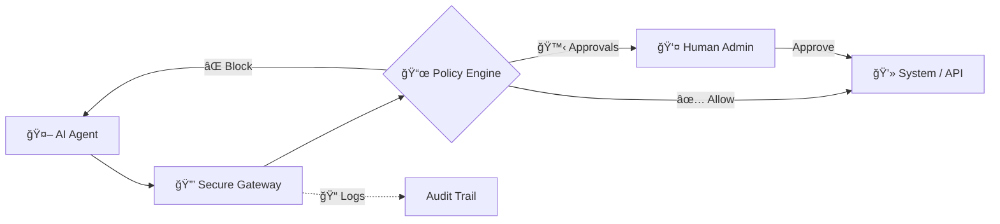

<div align="center">
  
  <h1>Permiscope</h1>
  <p><b>The Trust Layer for Autonomous AI Agents</b></p>

  <p>
    
    
    
  </p>
</div>

---

### 🛡️ Secure. 📜 Auditable. 🙋 Human-Driven.

**Permiscope** is an open-source infrastructure layer that mediates all real-world actions performed by autonomous AI agents. Think of it as **OAuth + Policy Engine + Audit System** for AI agents.

## 🚀 Why Permiscope?

Without mediation, agents operate with full system permissions — a single bug or prompt injection can cause catastrophic damage. Permiscope enforces **least privilege, human oversight, and auditability** by default, making autonomous systems safe for production.

---

## 🧠 The Problem

The industry has moved beyond “Look what this agent can do” to **“How do I stop this agent from breaking critical systems?”**

Current agent frameworks typically operate with:
*   ❌ All-or-nothing permissions
*   ❌ Minimal oversight
*   ❌ Limited traceability
*   ❌ High operational risk

## 🛡️ The Solution: Mediated Agency

Instead of agents directly accessing files, APIs, or shells, every action flows through Permiscope’s **Secure Execution Gateway**.



## ✨ Key Capabilities

<table width="100%">
  <tr>
    <td width="50%" valign="top">
      <h3>🔐 Granular Control</h3>
      <ul>
        <li><b>Permission Scopes:</b> ALLOW, BLOCK, or REQUIRE_APPROVAL for any action.</li>
        <li><b>Contextual Guardrails:</b> Case-insensitive path restrictions and <b>ReDoS-protected</b> command filtering.</li>
      </ul>
    </td>
    <td width="50%" valign="top">
      <h3>👤 Human-in-the-Loop</h3>
      <ul>
        <li><b>Approval Gateway:</b> Pause sensitive actions for manual review.</li>
        <li><b>Stable Approval Cache:</b> Prevent fatigue with deterministic, session-based caching.</li>
      </ul>
    </td>
  </tr>
  <tr>
    <td width="50%" valign="top">
      <h3>📝 Trust & Transparency</h3>
      <ul>
        <li><b>Tamper-Proof Logs:</b> HMAC-SHA256 signed hash chaining for audit integrity.</li>
        <li><b>Dry-Run Mode:</b> Simulate actions to understand results without side effects.</li>
      </ul>
    </td>
    <td width="50%" valign="top">
      <h3>🚀 Advanced Features</h3>
      <ul>
        <li><b>Shadow Mode:</b> Safely test untrusted agents in isolation.</li>
        <li><b>Authenticated Dashboard:</b> Securely manage approvals and monitor logs in real-time.</li>
      </ul>
    </td>
  </tr>
</table>

---

## 🚀 Quick Start
### 📦 Installation

```bash
npm install permiscope
```

### ⚡ 30-Second Quick Start

Get a guided tour of Permiscope in action:
```bash
npx permiscope --demo
```
*This demo showcases allowed, blocked, and human-approved actions in a safe environment.*

---

## 🔐 Security Configuration

Permiscope is designed for high-trust environments. Use these environment variables to harden your installation:

| Variable | Importance | Description |
|----------|------------|-------------|
| `PERMISCOPE_AUDIT_SECRET` | **Critical** | Secret key for HMAC-SHA256 audit log signing. |
| `PERMISCOPE_DASHBOARD_TOKEN` | **High** | Bearer token required to update approvals via the API/Dashboard. |
| `PERMISCOPE_STRICT_LOGGING` | Medium | Set to `true` to block actions if the audit log cannot be written. |

---

### 🛠️ Execution & CLI

Permiscope allows you to wrap agent commands safely:

- **✅ Allowed Action:**
  ```bash
  permiscope run_command "echo hello"
  ```
- **❌ Blocked Action (Dangerous):**
  ```bash
  permiscope run_command "rm -rf /"
  ```

### 💻 Web Dashboard

> [!IMPORTANT]
> In production, always set `PERMISCOPE_DASHBOARD_TOKEN` for the control plane.

1. **Start the Control Plane:**
   ```bash
   # From within the repository
   npm run dev:dashboard
   ```
2. **Access the Interface:** Open [http://localhost:3000](http://localhost:3000) to review approvals and live audit trails.

---

## 🏗️ Integration Guide

```typescript
import { createAgent } from 'permiscope';

// Default safe agent
const agent = createAgent();

// Action execution
const content = await agent.act('read_file', { path: 'config.json' });
```

### Advanced Customization

```typescript
import { createAgent, defaultPolicy } from 'permiscope';

const agent = createAgent({
  name: "custom-agent",
  policy: {
    scopes: [
       ...defaultPolicy.scopes,
       { actionName: "my_custom_action", decision: "ALLOW" }
    ]
  },
  shadowMode: false
});
```

---

## 🧪 Real-World Scenarios
Check out `src/scenarios/` for full demos:
1. **DevOps Agent**: Safely edits configs, blocked from restarting services.
2. **Data Agent**: Reads raw data, writes processed out, blocked from overwriting raw.

---

## 🤝 Contributing

We welcome community contributions! Permiscope uses structured templates for **Bug Reports**, **Feature Requests**, and **Pull Requests**.

1. Fork the repository.
2. Follow the [Contributing Guidelines](CONTRIBUTING.md).
3. Open a PR with our standardized template.

## 📄 License

MIT License. See `LICENSE` for more information.
