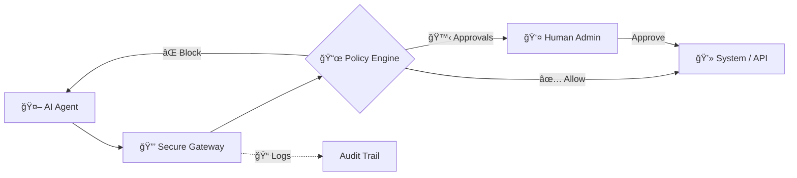

<div align="center">
  
  <h1>Permiscope</h1>
  <p><b>The Trust Layer for Autonomous AI Agents</b></p>

  <p>
    
    
    
  </p>
</div>

---

### 🛡️ Secure. 📜 Auditable. 🙋 Human-Driven.

**Permiscope** is an open-source infrastructure layer that mediates all real-world actions performed by autonomous AI agents. Think of it as **OAuth + Policy Engine + Audit System** for AI agents.

Its mission is to make autonomous systems **safe, trustworthy, and production-ready** by enforcing a robust "Mediated Execution Model."
---

## 🧠 The Problem

The industry has moved beyond “Look what this agent can do” to **“How do I stop this agent from breaking critical systems?”**

Current agent frameworks typically operate with:
*   ❌ All-or-nothing permissions
*   ❌ Minimal oversight
*   ❌ Limited traceability
*   ❌ High operational risk

## 🛡️ The Solution: Mediated Agency

Instead of agents directly accessing files, APIs, or shells, every action flows through Permiscope’s **Secure Execution Gateway**.



## ✨ Key Capabilities

<table width="100%">
  <tr>
    <td width="50%" valign="top">
      <h3>🔐 Granular Control</h3>
      <ul>
        <li><b>Permission Scopes:</b> ALLOW, BLOCK, or REQUIRE_APPROVAL for any action.</li>
        <li><b>Contextual Guardrails:</b> Path restrictions and command filtering (e.g., block <code>rm -rf</code>).</li>
      </ul>
    </td>
    <td width="50%" valign="top">
      <h3>👤 Human-in-the-Loop</h3>
      <ul>
        <li><b>Approval Gateway:</b> Pause sensitive actions for manual review.</li>
        <li><b>Approval Cache:</b> Prevent fatigue with session-based caching.</li>
      </ul>
    </td>
  </tr>
  <tr>
    <td width="50%" valign="top">
      <h3>📝 Trust & Transparency</h3>
      <ul>
        <li><b>Tamper-Aware Logs:</b> SHA-256 hash chaining for audit integrity.</li>
        <li><b>Dry-Run Mode:</b> Simulate actions to understand results without side effects.</li>
      </ul>
    </td>
    <td width="50%" valign="top">
      <h3>🚀 Advanced Features</h3>
      <ul>
        <li><b>Shadow Mode (V2):</b> Safely test untrusted agents in isolation.</li>
        <li><b>Web Dashboard (V2):</b> Manage approvals and monitor logs in real-time.</li>
      </ul>
    </td>
  </tr>
</table>
---

## 🚀 Quick Start
### 📦 Installation

Install globally for CLI use:
```bash
npm install -g permiscope
```

Or as a dependency in your project:
```bash
npm install permiscope
```

### 🛠️ Execution & CLI

Permiscope allows you to wrap agent commands safely. Use the following patterns to test the gateway:

> [!TIP]
> Once installed, you can use the `permiscope` command directly.

- **✅ Allowed Action:**
  ```bash
  permiscope run_command "echo hello"
  ```
- **❌ Blocked Action (Dangerous):**
  ```bash
  permiscope run_command "rm -rf /"
  ```
- **⚠️ Manual Approval Required:**
  ```bash
  permiscope --demo
  ```

### 💻 Web Dashboard & Monitoring

1. **Start the Control Plane:**
   ```bash
   npx ts-node src/dashboard/server.ts
   ```
2. **Access the Interface:** Open [http://localhost:3000](http://localhost:3000) to review approvals and live audit trails.

---

## 🏗️ Integration Guide

```typescript
import { createAgent } from 'permiscope';

const agent = createAgent();
const content = await agent.act('read_file', { path: 'config.json' });
```

### Simplified Adapter
For a lightweight "one-liner" integration:

```typescript
import { PermiscopeAdapter } from './src/adapters/PermiscopeAdapter';

const adapter = new PermiscopeAdapter({ policy: myPolicy });
const content = await adapter.act('read_file', { path: 'config.json' });
```

---

## 🧪 Real-World Scenarios
Check out `src/scenarios/` for full demos:
1. **DevOps Agent**: Safely edits configs, blocked from restarting services.
2. **Data Agent**: Reads raw data, writes processed out, blocked from overwriting raw.

---

## 🗺️ Roadmap

- [x] **Core Policy Engine** (Allow/Block logic)
- [x] **Secure Gateway** (Interception & Execution)
- [x] **Basic Guardrails** (File paths, Command regex)
- [x] **CLI & Human Approval**
- [x] **Tamper-Aware Logging** (SHA-256 Chaining)
- [x] **Policy-as-Code** (TypeScript Rules)
- [x] **Web Dashboard** (Visual approvals & logs)
- [x] **Shadow Mode** (Simulate success to test agent behavior)

## 🤝 Contributing

Permiscope is open-source. We welcome contributions! Please see `CONTRIBUTING.md` for details.

## 📄 License

MIT License. See `LICENSE` for more information.
