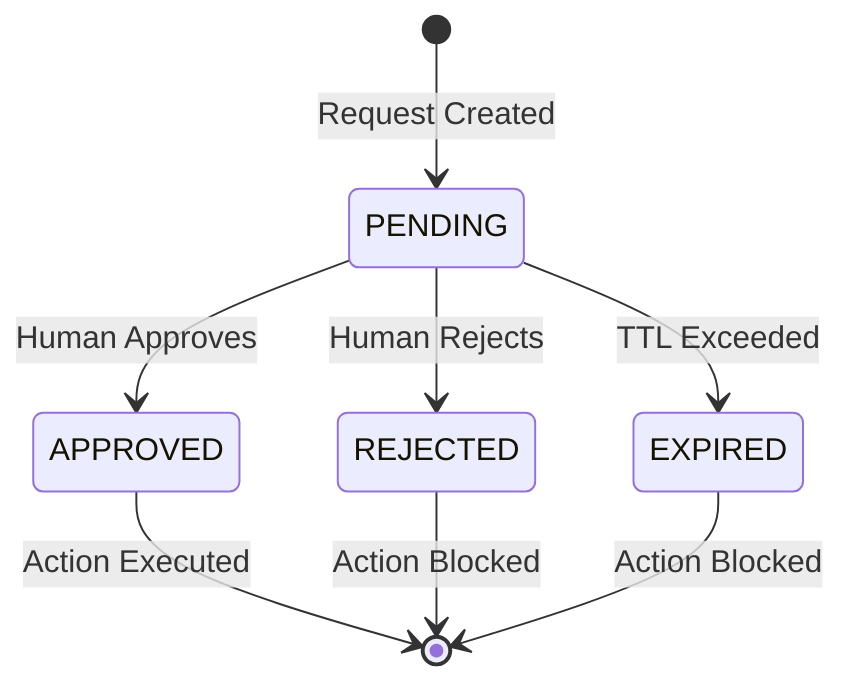

# Approvals Workflow

Permiscope supports human-in-the-loop approval for sensitive actions.

## Overview

When a policy scope specifies `REQUIRE_APPROVAL`, the action is paused until a human approves or rejects it.

## Approval Lifecycle



## Approval Request Structure

```typescript
interface ApprovalRequest {
  id: string;              // Unique key (base64 encoded)
  agentId: string;
  actionName: string;
  params: Record<string, any>;
  status: 'PENDING' | 'APPROVED' | 'REJECTED';
  timestamp: string;       // ISO format
  expiresAt?: string;      // TTL expiration
}
```

## Approval Key Generation

Keys are deterministic and based on:
- Agent ID
- Action name
- Parameters (using `fast-json-stable-stringify`)

This ensures the same action from the same agent produces the same key.

## CLI Polling

When running in CLI mode, Permiscope polls the approval cache:

```
🔔 [agent-001] wants to run_command: {"command":"rm -rf /tmp/*"}
Do you approve this action? (y/n)

[Polling for approval... Check dashboard at http://localhost:3000]
```

The CLI waits for:
1. Direct console input (`y`/`n`)
2. Dashboard approval (polled every 2 seconds)

## Dashboard Approval

The web dashboard allows managing approvals remotely:

1. Navigate to `http://localhost:3000`
2. View pending approvals
3. Click Approve or Reject
4. Action proceeds immediately

## Cache Behavior

| Behavior | Description |
|----------|-------------|
| **Auto-expiration** | Approvals expire after TTL (default: 1 hour) |
| **Reuse** | Same action reuses existing approval |
| **Revocation** | Dashboard can revoke approvals |
| **Persistence** | Saved to `data/approvals.json` |

## TTL Configuration

```typescript
const cache = new ApprovalCache('./data', 30 * 60 * 1000); // 30 min
```

## Concurrency Safety

- File locking via `proper-lockfile`
- All operations are `async` with lock acquisition
- Prevents race conditions between CLI and Dashboard

## Best Practices

1. **Use short TTLs** for sensitive actions
2. **Require re-approval** for destructive operations
3. **Monitor pending approvals** in Dashboard
4. **Set DASHBOARD_TOKEN** to prevent unauthorized approvals
