# Architecture

Permiscope is a **mediated execution layer** that sits between an external system (agent, script, or workflow) and real-world resources. Every action an external system wants to perform must pass through Permiscope's secure gateway.

## Overview

```mermaid
graph TD
    subgraph "External System"
        A["🤖 Agent / Script / Workflow"]
    end

    subgraph "Permiscope Trust Layer"
        B[PermiscopeAdapter]
        C[ExecutionGateway]
        D[PolicyEngine]
        E[ApprovalCache]
        F[AuditLogger]
    end

    subgraph "Resource Layer"
        G[File System]
        H[Shell/Commands]
        I[APIs]
    end

    A --> B
    B --> C
    C --> D
    D -->|ALLOW| C
    D -->|BLOCK| C
    D -->|REQUIRE_APPROVAL| E
    E --> C
    C --> G
    C --> H
    C --> I
    C --> F
```

## Components

### PermiscopeAdapter
- **Role**: Primary integration API.
- **Responsibility**: Provides a framework-agnostic way to wrap execution and route actions through the gateway.
- **Location**: `src/adapters/PermiscopeAdapter.ts`

### ExecutionGateway
- **Role**: Central orchestrator.
- **Responsibility**: Coordinates policy evaluation, approval handling, execution, and logging.
- **Location**: `src/gateway/ExecutionGateway.ts`

### PolicyEngine
- **Role**: Decision maker
- **Responsibility**: Evaluates actions against defined policies and guardrails
- **Location**: `src/engine/PolicyEngine.ts`

### ApprovalCache
- **Role**: State manager for approvals
- **Responsibility**: Tracks pending, approved, and rejected requests with TTL
- **Location**: `src/gateway/ApprovalCache.ts`

### AuditLogger
- **Role**: Immutable record keeper
- **Responsibility**: Maintains a tamper-evident, hash-chained audit log
- **Location**: `src/logging/AuditLogger.ts`

## Data Flow

1. **Agent Request**: Agent calls `agent.act(actionName, params)`
2. **Action Creation**: Adapter wraps request into an `Action` object
3. **Policy Evaluation**: Gateway asks PolicyEngine for a decision
4. **Decision Handling**:
   - `ALLOW`: Proceed to execution
   - `BLOCK`: Return error to agent
   - `REQUIRE_APPROVAL`: Check cache or prompt human
5. **Execution**: Built-in or custom executor performs the action
6. **Logging**: Result is appended to the audit log with hash chain
7. **Response**: Result returned to agent

## Trust Boundaries

| Boundary | Description |
|----------|-------------|
| **Agent ↔ Adapter** | Untrusted input. All parameters are validated. |
| **Gateway ↔ PolicyEngine** | Internal, trusted interface. |
| **Gateway ↔ System** | Actions are mediated. No direct agent access. |
| **Dashboard ↔ ApprovalCache** | Requires authentication token. |

## Key Design Principles

1. **Default Deny**: Unknown actions are blocked.
2. **Fail Closed**: Errors in validators or logging fail to BLOCK.
3. **Immutable Audit**: Hash chain prevents log tampering.
4. **Human Override**: Sensitive actions require explicit approval.
