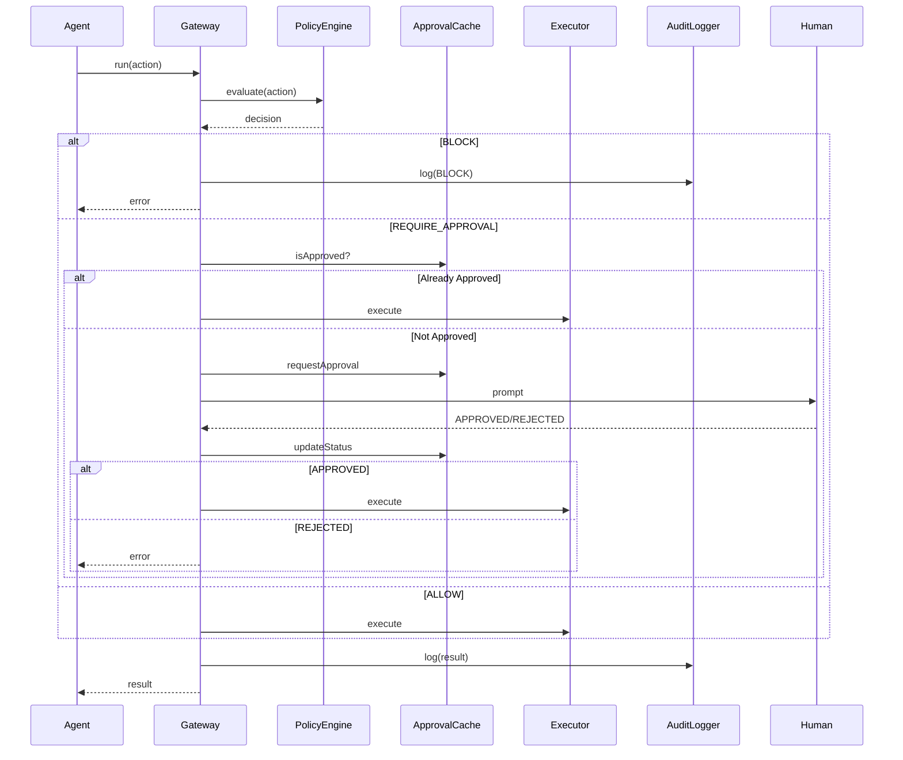

# Execution Gateway

The ExecutionGateway is the central orchestrator that coordinates policy evaluation, approval handling, action execution, and audit logging.

## Overview

```typescript
const gateway = new ExecutionGateway(policy, options);
const result = await gateway.run(action, dryRun);
```

## Responsibilities

1. Receive actions from the adapter
2. Request policy evaluation
3. Handle approval workflow
4. Execute actions (built-in or custom)
5. Log all events to the audit trail
6. Return results to the agent

## Execution Flow



## Configuration Options

```typescript
interface GatewayOptions {
  shadowMode?: boolean;      // Fake success for blocked actions
  executors?: Map<string, Executor>;  // Custom action handlers
  logDir?: string;           // Audit log directory
  approvalDir?: string;      // Approval cache directory
}
```

## Built-in Executors

| Action | Behavior |
|--------|----------|
| `read_file` | `fs.readFileSync(path)` |
| `write_file` | `fs.writeFileSync(path, content)` |
| `run_command` | `child_process.exec(command)` |

## Custom Executors

Register custom handlers for new action types:

```typescript
gateway.registerExecutor('call_api', async (action) => {
  const response = await fetch(action.parameters.url);
  return { success: true, output: await response.text() };
});
```

## Result Structure

```typescript
interface GatewayResult {
  decision: PermissionDecision;
  success: boolean;
  output?: string;
  error?: string;
}
```

## Shadow Mode

When enabled, blocked actions return fake success:

```typescript
const gateway = new ExecutionGateway(policy, { shadowMode: true });
```

- Agent sees `{ success: true, output: 'simulated' }`
- Actual action is not executed
- Logged with `SHADOW_BLOCK` decision
- Useful for observing untrusted agent behavior

## Error Handling

| Error | Behavior |
|-------|----------|
| Executor throws | Logged, error returned to agent |
| Policy error | BLOCK decision |
| Approval timeout | BLOCK (depends on implementation) |
| Log write fails (strict) | Action blocked |
