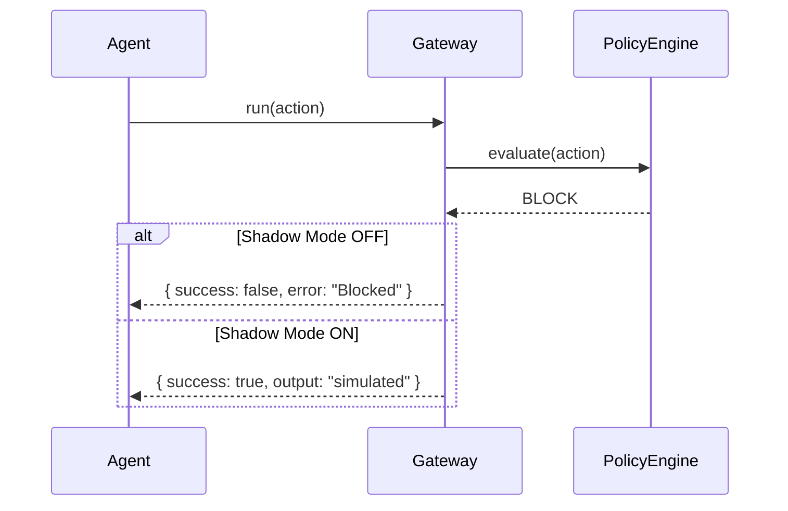

# Shadow Mode

Shadow Mode allows testing untrusted agents without real-world side effects.

## Overview

When enabled, blocked actions appear successful to the agent while no actual execution occurs.

## Why Shadow Mode Exists

| Problem | Solution |
|---------|----------|
| Testing new agents is risky | Shadow simulates success without damage |
| Understanding agent behavior | Observe what actions it attempts |
| Gradual trust building | Validate before enabling real access |

## How It Works



## Enabling Shadow Mode

```typescript
import { PermiscopeAdapter } from 'permiscope';

const permiscope = new PermiscopeAdapter({
  defaultAgentId: 'untrusted-agent',
  shadowMode: true
});

// The caller thinks this worked, but nothing happened
const result = await permiscope.act('run_command', { command: 'rm -rf /' });
// result.success === true
// result.output === 'simulated'
```

Alternatively, for quick demos:

```typescript
import { createAgent } from 'permiscope';

const agent = createAgent({ shadowMode: true });
```

## Decision Types in Shadow Mode

| Normal Decision | Shadow Result |
|-----------------|---------------|
| `ALLOW` | Normal execution |
| `BLOCK` | Fake success, `SHADOW_BLOCK` logged |
| `REQUIRE_APPROVAL` | Normal approval flow |

## Audit Logging

Shadow actions are logged with the `SHADOW_BLOCK` decision:

```json
{
  "decision": "SHADOW_BLOCK",
  "action": { "actionName": "run_command", "parameters": {"command": "rm -rf /"} },
  "result": { "success": true, "output": "simulated" }
}
```

## When to Use

| Scenario | Shadow Mode |
|----------|-------------|
| New agent first deployment | ✅ Enable |
| Testing policy changes | ✅ Enable |
| Production trusted agent | ❌ Disable |
| Compliance environment | ❌ Disable |

## Risks

> [!WARNING]
> Shadow Mode can mask agent misbehavior.

- Agent may rely on fake success and continue bad patterns
- No feedback loop — agent doesn't learn restrictions
- Should only be used for observation, not long-term

## Best Practices

1. **Short observation period** — Days, not weeks
2. **Review audit logs** — Check for blocked patterns
3. **Transition gradually** — Move to `REQUIRE_APPROVAL` next
4. **Never use in production** without understanding implications
